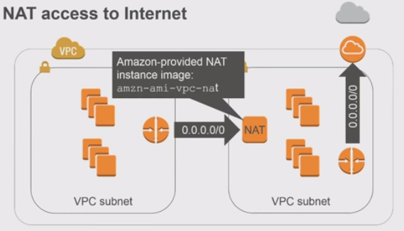

# Push Processors

Mozilla Push message log processors. These processors can be run under AWS
Lambda or deployed to a machine. This project also contains common helper
functions for parsing heka protobuf messages and running in AWS Lambda.

Currently this consists of a single processor for the Push Messages API.

## Push Message Processor

Processes push log messages to extract message metadata for registered crypto
public-keys.

Requires DynamoDB and Redis.

## Developing

Checkout this repo, you will need Redis installed and a local DynamoDB to test
against.

Then:

    $ virtualenv ppenv
    $ source ppenv/bin/activate
    $ pip install -r requirements.txt
    $ python setup.py develop

## Creating an AWS Lambda Zipfile

After modifying ``push_processor/settings.js`` for your appropriate settings, a
Lambda-ready zipfile can be created with make:

    $ make lambda-package

All files in the work directory are included except files listed in the
``ignore`` section of ``lambda.json``. Remove any other files that should not
be included in the zipfile from the work directory.

The AWS handler you should set is: ``lambda.handler``, which will then call
the Push Processor.

### Lambda VPC Access

The Push Processor needs access to both Redis and AWS DynamoDB. It will
likely be necessary to run the Lambda function in a VPC that has access to the
Elasticache Redis instance. Lambda requires the subnet(s) it runs in to have
NAT Gateway access to the Internet. A rough overview of what this looks like:

1. Define one or more 'private' subnets, these are where your Lambda
   function will run.
2. Define one or more 'public' subnets, these are where the NAT Gateway(s) will
   be.
3. Create the NAT Gateway(s) in the 'public' subnets.
4. Create a route table for the 'public' subnet(s), and route '0.0.0.0/0' to the
   VPC Internet Gateway. The public subnets should then be explicitly associated
   with the new route table.
5. Create a route table for the 'private' subnet(s), and route '0.0.0.0/0' to a
   NAT Gateway that you defined.

The Push Processor Lambda function should then be able to access both DynamoDB
and machines in the same 'private' subnet(s).
